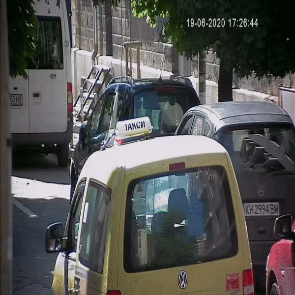
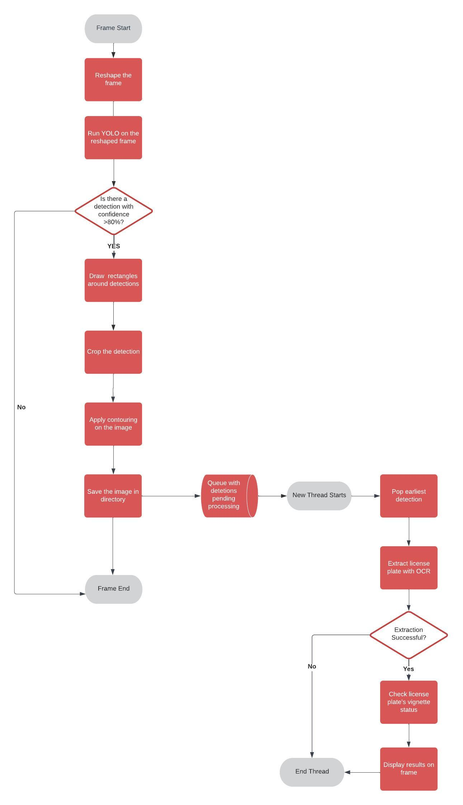

# YOLO-Vignette-Sticker-Validator

This repository contains code for license plate recognition using the YOLO (You Only Look Once) object detection model. The code allows you to detect vehicle license plates in videos and then validate whether the vehicle in question has valid vignette sticker. Validation requests are done through the website of the Bulgarian National Toll Administraiton.




## Getting Started

To get started with the code, follow the steps below:

### Prerequisites

Make sure you have the following installed:

- Python (version 3.6 or higher)
- PyTorch (version 1.7 or higher)
- Tesseract OCR (version 4.0 or higher)

### Clone the Repository

Clone this GitHub repository by running the following command:

```python
!git clone https://github.com/TASHINOV10/YOLO-Vignette-Sticker-Validator
```

### Install Dependencies

Navigate to the cloned repository and install the required libraries by running the following command:

```python
pip install -r requirements.txt
```

### Install Necessary Libraries

Import the necessary libraries in your Python script:

```python
import torch
from matplotlib import pyplot as plt
import numpy as np
import cv2
import pytesseract
import os
import pandas as pd
import re
from PIL import Image
from re import compile
import time
from datetime import datetime
import json
import requests
```

### Set the paths according to your setup

- Before running the OCR model, you need to define the path to the Tesseract executable file. The executable file is required for the OCR functionality to work properly. Follow the steps below to set the Tesseract path:

1. After running the requirements file , locate the directory where Tesseract is installed on your system. By default, it is usually installed in "C:\Program Files\Tesseract-OCR\".
2. Proceed  by running the below code. Make sure to do it every time when running the program.
   
```python
tesseract_executable = r'C:\Program Files\Tesseract-OCR\tesseract.exe'
pytesseract.pytesseract.tesseract_cmd = tesseract_executable
```

- Use the weights provided in the already cloned repository to run the trained YOLO model.
  
```python
weightsPath = 'C:/Users/Iliyan Tashinov/Desktop/yolo_project/weights/epochs_100/last.pt'
model = torch.hub.load('ultralytics/yolov5', 'custom', path= weightsPath, force_reload=True)
```

- You can test the program on any video file. For simplicity you can use the already provided test video in the cloned repository.
  
```python
video = 'C:/Users/Iliyan Tashinov/Desktop/yolo_project/video_test.mp4'
```
## Executing the rest of the code

### Defining the functions

- **format_frame** takes each frame from the video and turns it into a black and white image for facilitating the contouring process.

```python
def format_frame(frame):
    
    resultimage = cv2.cvtColor(frame, cv2.COLOR_BGR2GRAY)
     
    return resultimage
```

- **draw_rectangle** draws a rectangle around the area identified as a license plate by YOLO and returns the dimensions of the plate for eventually drawing the result of the vignette check above the detection

```python
def draw_rectangle(frame,detection):
    
        data = results.xyxy[0][i]
        a = (int(data[0]), int(data[1]))
        b = (int(data[2]), int(data[3]))
        
        cv2.rectangle(frame,a,b,(0,255,0), 3)
        
        return a, b
  ```
- **get_frameProportions** takes the original frame and computes the proportions relative to the reshaped frame.
Each frame is resized to 608/608 dimensions for facilitating the work of the YOLO algorithm. Then this function is executed so that the crop used for the OCR analysis is taken from the original frame.

```python
def get_frameProportions(frame):
    a,b = frame.shape
    
    a_p = a/608
    b_p = b/608
    
    return a_p, b_p
 ```   
- **get_crop** crops the area identified as a license plate.
  
```python
def get_crop(frame,detections):
    
    a,b = get_frameProportions(frame)
    data = detections
    crop = frame[int(detections[1]*a):int(detections[3]*a),
                 int(detections[0]*b):int(detections[2]*b)]
    return crop
```
   
- **get_contour1** performs a *binary* thresholding on the cropped image
```python
def get_contour1(crop):

    threshold = cv2.threshold(crop, 85, 255,cv2.THRESH_BINARY)[1]
    crop_contoured = cv2.bitwise_not(threshold)
    
    
    return crop_contoured
```
Thresholding is used for dividing the pixes into classes i.e. *foreground* and *background*. This process eliminates the noise and facilitates the work of the OCR algorithm.
The code allows the use of different thresholding techniques. The only thing that is needed is to create a function *get_countour*, numerate the type of thresholding and then just reference to the desired method in the main code.

- **extract_license** receives the contoured image and runs the OCR.
Here is a breakdown of the function:

```python
def extract_license(crop_contoured):

    analysis = cv2.connectedComponentsWithStats(crop_contoured,4,cv2.CV_32S)
    (totalLabels, label_ids, values, centroid) = analysis
    symbolList = []
    xCentroidList = []
```
First we define the function and then run the connected component algorithm on the contoured image *cv2.connectedComponentsWithStats(crop_contoured,4,cv2.CV_32S)*.
The algorithm computes the connected components of the binary image.

Next, the function loops through each label and extracts the area and centroids for that specific component.
If the area is in the defined conditions then the function proceeds by croppoing the component and passing it to the OCR for processing.

```python
    for i in range(1,totalLabels):
        
        area = values[i, cv2.CC_STAT_AREA] 
        X,Y = centroid[i]
        
        if (area < 50) or (area > 1000):
            continue

        x1 = values[i, cv2.CC_STAT_LEFT]
        y1 = values[i, cv2.CC_STAT_TOP]
        w = values[i, cv2.CC_STAT_WIDTH]
        h = values[i, cv2.CC_STAT_HEIGHT]

        #convert it to 255 value to mark it white
        component = (label_ids == i).astype("uint8") * 255

        # Increase brightness by multiplying with a scaling factor
        brightness_scale = 2  # Adjust this value to increase or decrease brightness
        component = component * brightness_scale
        cropped_component = component[y1-6:y1+h+6, x1-6:x1+w+6]
```

Here,the symbol is extracted from the OCR based on the assigned configurations. If no errors occur, the symbol is appended in a list and then joined and returned as string.

```python

        try:
            symbol = pytesseract.image_to_string(cropped_component, config='-c tessedit_char_whitelist=0123456789ABCDEFGHIJKLMNOPQRSTUVWXYZ --psm 10 --oem 3')
            symbol = symbol.replace('\n', '')
            print(symbol)
            symbolList.append(symbol)
            xCentroidList.append(X)

        except:
            continue
    
    print(symbolList)    
    xCentroidList, symbolList = zip(*sorted(zip(xCentroidList, symbolList)))
    license_plate = ''.join(symbolList)
            
    return license_plate
```
- **get_extraction** is a function that includes **get_crop**,**get_contour1** and **extract_license**. The functionalities are performed within this function and then the resulting string is checked if it matches with the format of the bulgarian vehicles' license plates. The reason for using a separate function to execute the multiple ones is because I am planning to separate this process to another thread and potentailly optimize the performance of the program.

```python
def get_extraction(gray_frame,detections,frame_count):
    
    frame_count = frame_count
    plate_format = re.compile('^[a-zA-Z]{2}[0-9]{4}[a-zA-Z]{2}$')
    plate_format1 = re.compile('^[a-zA-Z]{1}[0-9]{4}[a-zA-Z]{2}$')
    data = detections
    crop = get_crop(gray_frame,data)
    crop_contoured = get_contour1(crop)
    license_plate = extract_license(crop_contoured,frame_count)
    print(license_plate)
    
    if plate_format.match(license_plate) is not None or plate_format1.match(license_plate) is not None:
    
        return crop_contoured,license_plate
    
    license_plate = "N/A"
    return crop_contoured,license_plate
```
- **check_license** checks if the extracted license has valid vignette sticker.
  
```python
def check_license(license_plate):
        
  my_url = 'https://check.bgtoll.bg/check/vignette/plate/BG/' + license_plate
  x = requests.get(my_url)
  if (x.status_code != 200):
      result_text = "error"
      time_left = "error"
      return result_text, time_left
  
  p = json.loads(x.content)        
  
  if (p['vignette'] is None):
      result_text = "Vignette not valid."
      time_left = "N/A"
      return result_text,time_left
  
  result_text = "Vignette is valid"
  time_left = p['vignette']['validityDateToFormated']
  return result_text,time_left
```
### Main block

The main block is where the video frames are processed.

Several empty lists are defined for storing the results. 

```python
#set empty lists
crop_index = []
number_plate = []
date =[]
validation_df = []
time_remaining_lst = []
```
Then the video is loaded and the frames are resized for augmenting the work of YOLO

```python
#load video
cap = cv2.VideoCapture(video_1)
frame_count = 1


#start video
while cap.isOpened():
    
    
    ret, frame = cap.read() #ret is boolean, returns true if frame is available;
    frame_resized = cv2.resize(frame, (608, 608)) #resizing the frames for better utilization of YOLO
    
    results = model(frame_resized) #run YOLO on the resized frame
```
Next, a loop examines each detection and begins by confirming the confidence of the occurance.

```python
    print(f'-----number of plates detected = {len((results.xyxy[0]))} - at frame {frame_count}--------------')

    #    ---      ---      ---        0  1  2  3  4  5      
    #loop through elements in tensor[h1,w1,h2,w2,cf,lb] 
    for i in range(len(results.xyxy[0])): #len represents the number of tensors;n tensors is the number of detections;#the loop is executed for each tenso
                                           
        print(f'checking confidence level of detection - {i + 1} ')

        conf = results.xyxy[0][i][4] #take the ith tensor/detection ; #conf = data[4] #take the confidence of that detection
        
        if (conf < 0.80): #checking how confident is the model; not acceptable under 80%
            print("detection's confidence is too low")
            print(f'++++end of analysis for detection number++++ {i+1}')
            continue
            
        print(f'passed the confidence test')
  ```
If the detection passes the confidence threshold, the functions mentioned above are executed.
```python
        a,b = draw_rectangle(frame_resized,results.xyxy[0][i])
        gray_frame = format_frame(frame)
        extraction = get_extraction(gray_frame, results.xyxy[0][i],frame_count)
        text_license = extraction[1]
        
        if text_license == "N/A":
            continue
```

If the extraction process was successful the plate number is checked if it has been processed before. If false, the data related to the detection is collected. If true, the data regarding the detection is fetched from the list and pritend on the frame.

```python
        #check if plate has already been processed
        if (text_license in number_plate):
            
            print(f'{text_license} is already recorded')
            plate_index = number_plate.index(text_license)
            frame_resized = cv2.putText(frame_resized, f"{validation_df[plate_index]} || {time_remaining_lst[plate_index]}", (a[0],a[1]-30), cv2.FONT_HERSHEY_SIMPLEX,
            1, (255,0,0), 1, cv2.LINE_AA)
            continue
    
        
        print('new license plate found')
        validation = check_license(text_license) #Validating sticker
        vignette_status = validation[0]
        time_remaining = validation[1]


        frame_resized = cv2.putText(frame_resized, f"{vignette_status} || {time_remaining}", (a[0],a[1]-30), cv2.FONT_HERSHEY_SIMPLEX,
        1, (255,0,0), 1, cv2.LINE_AA)
        print(f'data for detection number and license plate {i+1} => {text_license} has been collected')

        #gathering data
        number_plate.append(text_license) # add number_plate
        crop_index.append(frame_count) # record frame of detection
        date.append(datetime.today().strftime("%d/%m/%Y %H:%M:%S")) #record time of detection
        validation_df.append(vignette_status) #add vignette status
        time_remaining_lst.append(time_remaining) #add remaining time of vignette


        print(f'++++end of analysis for detection number {i+1}++++')
        
    frame_count += 1
    
    #display frame
    cv2.imshow('YOLO', frame_resized)
    
    if cv2.waitKey(10) & 0xFF == ord('s'):
        break
        
cap.release()
cv2.destroyAllWindows()


#aggregate data
data = list(zip(crop_index,number_plate,date
                ,validation_df,time_remaining_lst))
df = pd.DataFrame(data,columns = ["frame","number plate","time of detection","sticker status","time until expiry"])
```
## Process Flow Diagram



